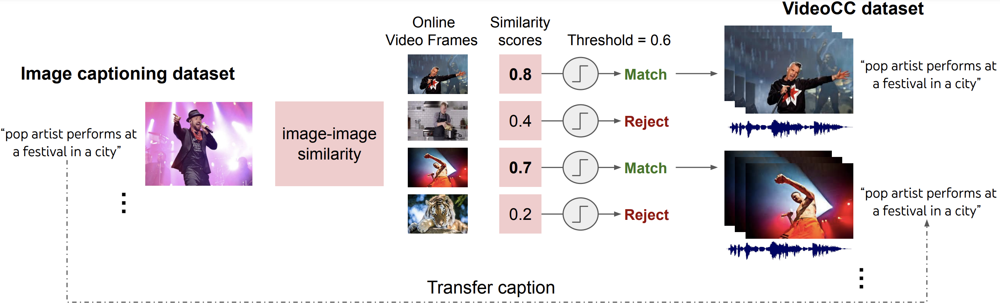

# VideoCC

VideoCC is a dataset containing (video-URL, caption) pairs for training
video-text machine learning models. 

It is created using an automatic pipeline starting from the Conceptual Captions
Image-Captioning Dataset. 

## Paper 

More details are available in [this
paper](https://arxiv.org/pdf/2204.00679.pdf) at ECCV 2022. Please cite the paper if
you use or discuss this dataset in your work.

<pre>
@inproceedings{nagrani2022learning,
  title = {Learning Audio Video Modalities from Image Captions},
  author = {Nagrani, Arsha and Hongsuck Seo, Paul and Seybold, Bryan, and Hauth Anja, and Santiago, Manen, and Chen, Sun and Schmid, Cordelia},
  booktitle = {ECCV},
  year = {2022},
}
</pre>

## Data Format for VideoCC 

The data is provided [here](https://storage.cloud.google.com/videocc_public_files/video_cc_public.csv) as a single CSV file with the following columns: 

Video URL, Start timestamp (microseconds), End timestamp(microseconds), Caption. 

